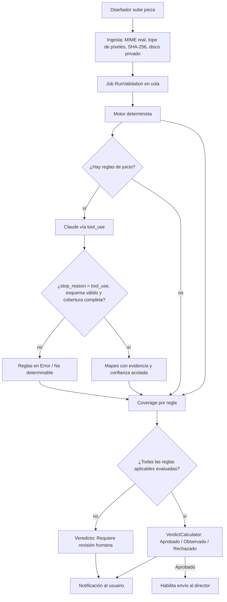

# Auditoría interna: Validador de Piezas

**Fecha:** 25/09/2026. **Commit base:** `6a7acca`, más los cambios sin commit del working copy.
**Alcance:** seguridad y autorización, veracidad del motor de validación, datos, operación, pruebas e higiene del repositorio.
**Método:** se leyó el código completo (unas 10 mil líneas en `app/`, `config/`, `database/`, `routes/`, `resources/`, `tests/` y los scripts de la raíz). Los hallazgos críticos se verificaron por segunda vez contra el código. No se ejecutaron las pruebas y no se hizo pentest en vivo: lo que depende del comportamiento interno de Filament o Livewire está marcado **[a verificar]**.

---

## 1. Resumen ejecutivo

La base de dominio está bien planteada: snapshot y hash de reglas por ejecución, evidencia con FKs restrictivas, CIEDE2000 y contraste WCAG correctos, salida de la IA forzada por `tool_use`, y policies registradas de forma explícita. Aun así, **no está lista para producción**, por tres bloques de problemas:

1. **El motor falla abierto (viola el requisito de veracidad).** Si la IA falla, falta, está simulada o trunca su respuesta, o si un evaluador lanza una excepción, la pieza puede salir **"Aprobado 100"**. Además, la API y el panel reportan como "cumple" reglas que nunca se midieron.
2. **Hay escalamiento de privilegios entre clientes.** Un `client_admin` puede darse acceso a cualquier otro cliente desde los formularios de Usuario, Equipo o Marca. Varias acciones de tabla (Publicar, Nueva versión, Revalidar, Validar con otro modelo) no pasan por ninguna policy.
3. **Hay exposición de datos y operación frágil.** Las piezas se guardan en el disco `public`, así que se sirven sin sesión. Los tokens de API no vencen y sobreviven a la desactivación del usuario. La cola es `sync`, el job no es idempotente y la bitácora de auditoría nunca se escribe.

**Recomendación:** corregir los 9 críticos (sección 3) antes de subir a un VPS. Estimación orientativa: 4 a 6 días de desarrollo, más pruebas.

| Severidad | Cantidad |
|---|---|
| Crítico | 9 |
| Alto | 16 |
| Medio | 22 |
| Bajo | 20+ |

---

## 2. Diferencias entre lo declarado y lo real

| Declarado | Real en el repositorio | Implicancia |
|---|---|---|
| Inertia + Vue | **No están instalados.** `composer.json` no incluye `inertiajs/inertia-laravel` y `package.json` solo trae Tailwind y Vite. `resources/js/app.js` está vacío. | Todo el frontend es Filament 5 + Livewire. Si habrá un frontend en Vue, hay que decidirlo ahora (ver sección 9). |
| Tiempo real (WebSockets) | `BROADCAST_CONNECTION=log`. No hay Reverb, Echo, `->poll()` ni `databaseNotifications()`. | Con una cola asíncrona real, el usuario no ve su veredicto hasta que recarga la página. |
| Idioma español | `APP_LOCALE=en`, solo existe `lang/en` y `timezone` es UTC. | Filament y los mensajes de validación salen en inglés, y las fechas quedan 5 horas adelantadas respecto de Lima. |
| Auditoría | `AuditLogger` y `spatie/activitylog` están instalados, pero **nada escribe en ellos**. | No hay forma de responder "quién publicó, quién cambió un rol o quién anuló un veredicto". |

---

## 3. Hallazgos críticos (bloquean producción)

### Veracidad del motor

**C-01. Si la IA falla, el veredicto se calcula igual (fail-open).** `app/Services/ValidationRunner.php:104-111`
```php
} catch (Throwable $e) { $meta['ai_error'] = $e->getMessage(); }
$reglasAplicadas = $resolved->rules->count();   // cuenta reglas resueltas, no evaluadas
```
- **Escenario:** timeout, error 429, falta de API key o un `TypeError`. Una marca que solo tiene reglas de juicio queda con 0 hallazgos y sale **"Aprobado 100"**.
- **Corrección:** pasar al calculador las reglas **evaluadas**. Cualquier regla de juicio sin evaluar debe forzar `NotEvaluated` (o un estado nuevo, `RequiereRevision`). El veredicto nunca puede ser `Approved`. Ver el código en la sección 6.1.

**C-02. Una excepción en un evaluador determinista se interpreta como "cumple".** `app/Services/Validation/DeterministicEngine.php:66-70`
- El error solo se guarda en `meta`. La regla afectada (por ejemplo PAL-501 con un hex inválido) aparece como cumplida.

**C-03. Se reporta "cumple" sin haber medido.** `ValidationController.php:~172-178` y `validacion-rapida.blade.php:~83`
- Toda regla determinista sin hallazgo entra en `passed_codes`, aunque no se haya evaluado. Casos concretos:
  - FMT-501 sin canal.
  - TYPO-501 con menos de 2 colores.
  - PAL-501 cuando falló la extracción de la paleta o la paleta no tiene colores.
  - Categorías sin evaluador (`copy`, `required_assets`).
- **Corrección:** cada evaluador declara explícitamente qué reglas evaluó. Lo que no declare queda como `no_evaluada`.

**C-04. El driver simulado es el valor por defecto y fabrica evidencia.** `config/ai.php:19`: `env('AI_DRIVER', 'fake')`
- Con ese driver, `FakeProvider` inventa todo esto:
  - Un logo detectado con bounding box. `LogoEvaluator` mide sobre esa caja y guarda hallazgos con `origin=ai`.
  - Un hallazgo con confianza 0.5.
  - `extracted_text = "Texto simulado..."`.
  - Un costo.
- Si en el servidor falta `AI_DRIVER`, **producción emite veredictos inventados** y el sistema no avisa.
- **Corrección:** que `fake` lance una excepción en `production`. Si la ejecución fue simulada, el veredicto es `NotEvaluated` y no se persisten el logo ni el texto.

### Seguridad

**C-05. Un `client_admin` se agrega a equipos de otros clientes.** `Users/Schemas/UserForm.php:106-114`
- `Select::make('teams')->relationship('teams','name')` no filtra por alcance, y `UserPolicy::update` le permite editarse a sí mismo.
- **Ataque:** se edita su propio usuario, se agrega al equipo del cliente B y obtiene acceso a todo B.

**C-06. El formulario de equipo acepta clientes, marcas y usuarios de cualquier tenant.** `Teams/Schemas/TeamForm.php:55-82`
- Los tres `relationship(...)->preload()` no tienen filtro. `TeamPolicy::update` valida el estado del equipo **antes** de guardar, no el que se va a guardar.
- **Ataque:** edita su propio equipo, agrega el "Cliente B" en "Clientes completos" y obtiene acceso total. El desplegable además muestra a todos los usuarios del sistema.

**C-07. Las piezas son públicas y la extensión la decide el cliente.** Con `FILESYSTEM_DISK=public`:
- `CreateSubmission.php:40`, `EditSubmission.php:75` y `QuickValidation.php:50` guardan en `storage/app/public`, que se sirve en `/storage/...` **sin autenticación**. Las campañas no lanzadas quedan accesibles para quien conozca la URL, y un usuario desactivado conserva las URLs que ya tenía.
- `SubmissionForm.php:102` usa `getClientOriginalExtension()`. Un PNG válido renombrado a `.html` pasa la validación MIME y se sirve como HTML: **XSS en el mismo origen que `/admin`** [a verificar en vivo].
- `BrandAssetForm.php:68` acepta SVG en el disco público, lo que abre la puerta a XSS por SVG.
- No existe `config/livewire.php`, así que los temporales (`livewire-tmp/`) probablemente van al disco por defecto (`public`) [a verificar].

**C-08. Los tokens de API no vencen y sobreviven a la desactivación.**
- `config/sanctum.php:53` tiene `expiration => null`.
- `createToken($nombre)` se crea con habilidades `['*']`.
- `ValidationController::store` no revisa `is_active` ni `validation.trigger`.
- Nada revoca los tokens cuando se desactiva un usuario.
- **Escenario:** un diseñador externo al que se da de baja sigue validando (y gastando) y leyendo marcas con el plugin.

**C-09. Las acciones de tabla no pasan por las policies.** `publish`, `validar` y `revisar` existen en las policies, pero **nada las invoca**.

| Acción | Archivo | Quién puede ejecutarla hoy |
|---|---|---|
| Publicar RuleSet | `RuleSetsTable.php:90-139` | Cualquiera con `knowledge.view` (uploader, reviewer, auditor) |
| Nueva versión RuleSet | `RuleSetsTable.php:141-202` | Cualquiera con `knowledge.view` |
| Publicar PromptTemplate | `EditPromptTemplate.php:26-49` | Quien pueda editar. Un `brand_admin` publica a nivel **cliente** |
| Revalidar carga o pieza | `SubmissionsTable.php:73-91`, `AssetsTable.php:251-285`, `AssetsRelationManager.php:176-238` | Incluye al `auditor` y al `client_admin`, que no tienen `validation.trigger` |
| Validar con otro modelo (Opus) | mismos archivos | `hasGlobalAccess()`, **que incluye al auditor** |

---

## 4. Hallazgos altos

| ID | Área | Hallazgo | Ubicación |
|---|---|---|---|
| A-01 | Seguridad | Una marca puede crearse o mudarse a otro cliente (`client_id` sin filtro y editable). Con eso se hereda acceso al cliente destino. | `BrandForm.php:25-31` |
| A-02 | Veracidad | No se revisa `stop_reason`. Una respuesta truncada por `max_tokens` trae menos hallazgos y produce una aprobación falsa. | `AnthropicProvider.php:99-106` |
| A-03 | Veracidad | El modelo no puede declarar "no determinable" por regla. `overall_notes` se ignora y una lista vacía se lee como "cumple todo". | `PromptTemplateSeeder.php:73,119` |
| A-04 | Veracidad | La validación del esquema es mínima: `evidence` no es obligatorio, `confidence` no se acota (un 85 pasa como seguro) y el esquema cae en `['type'=>'object']` si falta. | `AiEvaluator.php:68,113-141`, `AiFindingMapper.php:44` |
| A-05 | Veracidad | El modelo puede bajar a `info` una regla `is_locked` bloqueante con confianza alta, y la pieza se aprueba. | `AiFindingMapper.php:131-133` |
| A-06 | Veracidad | Logo: `detected:false` con confianza 0.2 produce igual un hallazgo **bloqueante**. Se aplica a sellos y marcas de agua que el modelo nunca evaluó. | `LogoEvaluator.php:55-90` |
| A-07 | Veracidad | Una bounding box incompleta o en píxeles se convierte en 0 y genera hallazgos inventados ("el logo ocupa 0.0%"). | `LogoEvaluator.php:99-102` |
| A-08 | Veracidad | El mapper acepta códigos de reglas deterministas en la respuesta de la IA, así que la IA puede contradecir una medición. | `AiFindingMapper.php:37` |
| A-09 | Operación | Con la cola en `sync`, Claude corre dentro de la petición HTTP en un bucle por pieza. `QuickValidation` es síncrono siempre, y en el peor caso 120 s × 3 reintentos superan el timeout del proxy. | `QuickValidation.php:56`, `CreateSubmission.php:44-49` |
| A-10 | Operación | El job no es idempotente: `retry_after` (90) es menor que `timeout` (180), así que se duplican ejecuciones y costo. `tries=3` crea 3 ejecuciones y 3 cobros. No tiene `ShouldBeUnique` ni `failed()`. | `RunValidation.php:29-31`, `config/queue.php:43` |
| A-11 | Datos | Carrera en "una sola versión publicada": dos publicaciones simultáneas pueden dejar **ninguna vigente**, y entonces se valida sin reglas de marca. | `RuleSetObserver.php:44-55`, `PromptTemplateObserver.php:34-39` |
| A-12 | Datos | La inmutabilidad es solo de aplicación: se salta con el query builder, `DB::table` o `withoutEvents`. `Verdict`, `Finding`, `HumanReview` y `PromptTemplate` publicado no la tienen. | `Concerns/Immutable.php:33-47` |
| A-13 | Auditoría | `AuditLogger` y `activity_log` nunca se escriben. | `AuditLogger.php` (sin llamadas) |
| A-14 | Datos | Una ejecución se puede revisar dos veces (TOCTOU, sin índice único). Un reviewer puede anular el veredicto de su propia pieza y `review.override` nunca se comprueba. | `ReviewRecorder.php:52-66` |
| A-15 | Operación | Las alertas de respaldo van a `your@example.com` y el monitor apunta a un disco `s3` de ejemplo. | `config/backup.php:279,348-355` |
| A-16 | Higiene | Hay scripts versionados en la raíz que reescriben código o datos (`aplicar-*.php`, `reparar-*.php`, `revalidar.php`) o que exponen datos de clientes (`diagnostico-*.php`). Ninguno comprueba `PHP_SAPI`. | raíz del repo |

---

## 5. Hallazgos medios y bajos

### Medios

- **Filtros que filtran datos entre clientes.** Los `SelectFilter` y los formularios listan clientes y marcas de toda la cartera: `BrandsTable:46`, `RuleSetsTable:73`, `PalettesTable:59`, `SubmissionsTable:55`, `BrandAssetsTable:92`, `PromptTemplatesTable:79`, `RuleSetForm:41-61` y `PromptTemplateForm:25-52`.
- **`submission.view_own` no se aplica en los listados.** Un uploader ve y revalida las cargas de sus compañeros (`SubmissionResource` no tiene `getEloquentQuery`).
- **El modelo de IA en ValidacionRapida no se valida.** `$modelo` es público y no se compara contra `ai.available_models`: cualquier uploader puede elegir Opus o un id arbitrario.
- **Bomba de descompresión.** `imagecreatefrom*` corre sin tope de píxeles. Se produce un error fatal por memoria que `catch (Throwable)` no captura.
- **`UserPolicy::compartenAlcance` es laxa.** Con una marca en común, un `brand_admin` puede editar o desactivar a un `client_admin`.
- **Brute force en `/api/v1/login`.** No hay bloqueo por cuenta ni política de contraseñas, y el panel no tiene 2FA.
- **Prompt injection.** `campaign`, `product` y `objective` se insertan en el prompt sin delimitar como datos.
- **Severidad y confianza.**
  - Una regla Info dudosa sube a Menor (`AiFindingMapper:122`).
  - Los hallazgos heurísticos se guardan con confianza 1.0, y el prompt le dice a la IA que son "medición exacta".
  - Los evaluadores fijan su propia severidad e ignoran la de la regla.
- **Paleta.**
  - Se recorta a 8 colores, así que un prohibido en el puesto 9 no se detecta.
  - Se ignoran los perfiles ICC y CMYK.
  - Los PNG indexados de 160 px o menos devuelven índices en lugar de RGB [a verificar].
- **`PromptBuilder:155` afirma algo que no verificó.** Envía "El análisis por código no encontró incumplimientos" aunque hayan fallado evaluadores.
- **Reintentos.** Solo se reintenta ante `ConnectionException`: los 429, 5xx y 529 no, y no se respeta `retry-after`.
- **Trazabilidad incompleta.** No se guardan:
  - El prompt renderizado.
  - La paleta y sus tolerancias en el snapshot.
  - `stop_reason`.
  - El hash de la imagen enviada.
  - La versión de los evaluadores.
- **Haiku puede emitir veredictos**, aunque `config/ai.php` dice que no sirve para juzgar.
- **Otros medios:**
  - El índice único de plantillas no protege las generales (NULL en MySQL).
  - `ProbarRestauracion` pone la contraseña en la línea de comandos (visible en `ps`).
  - `Storage::path()` supone disco local, así que falla con S3.
  - `shouldBeStrict(true)` en producción convierte regresiones en errores 500.
  - `with('latestRun.findings')` carga `raw_model_response` en cada fila.
  - La navegación usa `'Operacion'` en el provider y `'Operación'` en los recursos.
  - `env()` en `routes/console.php:89` deja de funcionar con `config:cache`.
  - Las pruebas corren en SQLite y producción es MySQL.

### Bajos

- **Scripts de la raíz y `.bak`.** Los archivos `.php.bak` versionados en `app/` y `database/`, y `dbValidador_testing` (SQLite) están **commiteados** en git. `PARCHES.md` son instrucciones para pegar código a mano.
- **Errores internos expuestos.** `ValidationController:71-75` y las notificaciones devuelven `$e->getMessage()` al cliente.
- **`bootstrap/app.php`.** `redirectGuestsTo` siempre devuelve `null`.
- **Token en el snapshot de Livewire.** `MisTokens::$tokenNuevo` es propiedad pública, así que el token en claro viaja en el snapshot.
- **Panel sin rol mínimo.** `canAccessPanel` solo revisa `is_active`: entra cualquier usuario activo aunque no tenga rol.
- **`external_ref` sin filtro de dueño.** Agrupa piezas en la carga de otro usuario porque no filtra por `user_id`.
- **Costos.** Un modelo sin precio reporta costo 0.0 en lugar de "desconocido". No se usa prompt caching ni hay tope de gasto por marca o día.
- **Seeders.**
  - `DemoDataSeeder` corre también en producción.
  - Los usuarios demo comparten contraseña con el administrador.
  - `knowledge_chunks` no se usa en ningún sitio.
- **`last_login_at`.** Solo se actualiza con el login de la API, no con el del panel.
- **`Asset::duplicates()`.** No funciona con eager loading.
- **`composer.json`.** `intervention/image` está declarado pero no se usa, y el nombre sigue siendo `laravel/laravel`.
- **Namespace de un test.** `VerdictCalculatorUmbralesTest` (sin commit) declara el namespace `Tests\Feature` pero está en `tests/Unit`, y el comentario de `test_el_corte_de_rechazo_es_estricto` tiene la aritmética mal (3 mayores dan 55, no 45).
- **Entorno local.** `DB_USERNAME=root`. En producción debe ser un usuario dedicado con privilegios mínimos.
- **Visibilidad pública.** `/` muestra la página de bienvenida de Laravel y `robots.txt` permite todo. Al ser una herramienta interna, conviene `noindex`.

---

## 6. Implementación de las correcciones críticas

> El código es orientativo y sigue las convenciones del proyecto. Antes de aplicarlo, hay que confirmar las firmas de Filament 5 en `vendor/`.

### 6.1 Veredicto que falla cerrado (C-01, C-02, C-03, C-04)

Cada evaluador y la IA informan su **cobertura**. El calculador solo aprueba si todas las reglas aplicables se evaluaron.

`app/Services/Validation/Coverage.php`
```php
<?php

declare(strict_types=1);

namespace App\Services\Validation;

enum RuleOutcome: string
{
    case Evaluated = 'evaluated';          // se midio o juzgo con evidencia
    case NotDeterminable = 'not_determinable'; // se intento, no hay base para afirmar
    case Error = 'error';                  // fallo tecnico
    case NotEvaluated = 'not_evaluated';   // nadie la cubrio
}

final class Coverage
{
    /** @var array<string, RuleOutcome> */
    private array $porRegla = [];

    public function mark(string $code, RuleOutcome $outcome): void
    {
        // Nunca se "mejora" un estado: un error no se pisa con un evaluated posterior.
        $actual = $this->porRegla[$code] ?? null;
        if ($actual === null || $actual === RuleOutcome::Evaluated) {
            $this->porRegla[$code] = $outcome;
        }
    }

    /** @param iterable<string> $codigosAplicables */
    public function pendientes(iterable $codigosAplicables): array
    {
        $faltan = [];
        foreach ($codigosAplicables as $code) {
            $estado = $this->porRegla[$code] ?? RuleOutcome::NotEvaluated;
            if ($estado !== RuleOutcome::Evaluated) {
                $faltan[$code] = $estado;
            }
        }
        return $faltan;
    }

    public function toArray(): array
    {
        return array_map(fn (RuleOutcome $o) => $o->value, $this->porRegla);
    }
}
```

En `ValidationRunner`:
- El motor determinista marca cada regla que realmente evaluó.
- La IA marca `Evaluated` solo si `stop_reason === 'tool_use'`, el esquema es válido y existe una entrada en `rule_assessments` para cada regla de juicio.
- Si hay un `catch`, todas las reglas de juicio quedan en `Error`.

```php
$pendientes = $coverage->pendientes($resolved->rules->pluck('code'));

$run->verdict()->create(
    $this->calculator->calculate(
        $run->findings()->get(),
        $brand,
        rulesEvaluated: $resolved->rules->count() - count($pendientes),
        pendientes: $pendientes, // cualquier pendiente => RequiereRevision, nunca Approved
    )
);
$meta['coverage'] = $coverage->toArray();
```

`config/ai.php`
```php
'driver' => env('AI_DRIVER', 'anthropic'),
```

`app/Services/Ai/VisionProviderFactory.php` (al resolver el driver)
```php
if ($driver === 'fake' && app()->isProduction()) {
    throw new \LogicException('AI_DRIVER=fake no esta permitido en produccion.');
}
```

Cambio en la salida de la IA (esquema del tool en `PromptTemplateSeeder`): se agrega `rule_assessments` como **obligatorio**, con una entrada por cada regla de juicio. Cada entrada lleva `rule_code`, `status` (`cumple`, `incumple` o `no_determinable`), `evidence` y `confidence` (entre 0 y 1). El código valida que no falte ningún código de regla y descarta `rule_code` desconocidos o deterministas.

### 6.2 Autorización en acciones de Filament (C-09)

```php
// RuleSetsTable.php
Action::make('publish')
    ->authorize(fn (RuleSet $record): bool => auth()->user()->can('publish', $record))
    // ...
Action::make('newVersion')
    ->authorize(fn (): bool => auth()->user()->can('create', RuleSet::class))

// AssetsTable / AssetsRelationManager
Action::make('revalidar')
    ->authorize(fn (Asset $record): bool => auth()->user()->can('validar', $record))
Action::make('otroModelo')
    ->visible(fn (): bool => auth()->user()->hasRole('super_admin'))
    ->authorize(fn (Asset $record): bool => auth()->user()->can('validar', $record))
```

`->authorize()` se evalúa en el servidor al ejecutar la acción. No basta con `->visible()`, porque solo oculta el botón.

### 6.3 Selects acotados por alcance (C-05, C-06, A-01)

```php
Select::make('teams')
    ->relationship('teams', 'name', modifyQueryUsing: fn (Builder $q) =>
        auth()->user()->hasRole('super_admin')
            ? $q
            : $q->whereIn('teams.id', auth()->user()->teams()->pluck('teams.id')))
    ->visible(fn (): bool => auth()->user()->hasRole('super_admin')), // opcion mas simple
```

Además, se revalida en el servidor (`EditTeam.php`):
```php
protected function beforeSave(): void
{
    $u = auth()->user();
    $clientes = collect($this->data['clients'] ?? []);
    $marcas = collect($this->data['brands'] ?? []);

    abort_unless(
        $u->hasRole('super_admin')
        || ($clientes->diff($u->accessibleClientIds())->isEmpty()
            && $marcas->diff($u->accessibleBrandIds())->isEmpty()),
        403
    );
}
```

En `BrandForm`: filtrar `client_id` por `accessibleClientIds()` y usar `->disabledOn('edit')`.

### 6.4 Piezas en disco privado (C-07)

`.env` de producción:
```
FILESYSTEM_DISK=local
```

`config/livewire.php` (se publica con `php artisan livewire:publish --config`):
```php
'temporary_file_upload' => ['disk' => 'local', /* ... */],
```

`routes/web.php`:
```php
Route::middleware(['web', 'auth'])->get('/piezas/{asset}', function (\App\Models\Asset $asset) {
    Gate::authorize('view', $asset);
    return Storage::disk('local')->response($asset->path, null, [
        'X-Content-Type-Options' => 'nosniff',
        'Content-Security-Policy' => "default-src 'none'; img-src 'self'; sandbox",
    ]);
})->name('piezas.ver');
```

Nombre de archivo: `Str::ulid().'.'.$file->guessExtension()`, con la extensión restringida a `jpg`, `png` o `webp`. SVG queda fuera de los activos de marca; si se necesita, hay que sanitizarlo y rasterizarlo al subirlo.

### 6.5 Tokens de API (C-08)

`config/sanctum.php`
```php
'expiration' => 60 * 24 * 30, // 30 dias
'token_prefix' => env('SANCTUM_TOKEN_PREFIX', 'vp_'),
```

`app/Http/Middleware/EnsureApiUserIsActive.php`
```php
public function handle(Request $request, Closure $next): Response
{
    $u = $request->user();
    abort_unless($u?->is_active && $u->hasPermissionTo('validation.trigger'), 403);
    return $next($request);
}
```

`UserObserver::saved`
```php
if ($user->wasChanged('is_active') && ! $user->is_active) {
    $user->tokens()->delete();
}
```

### 6.6 Job idempotente (A-09, A-10)

```php
final class RunValidation implements ShouldQueue, ShouldBeUnique
{
    public int $tries = 1;          // los reintentos transitorios van dentro del provider
    public int $timeout = 240;
    public int $uniqueFor = 600;

    public function uniqueId(): string { return (string) $this->assetId; }

    public function failed(Throwable $e): void
    {
        ValidationRun::where('asset_id', $this->assetId)
            ->where('status', ValidationStatus::Running)
            ->update(['status' => ValidationStatus::Failed, 'error_message' => 'Tiempo o error de proceso']);
        // notificar al usuario (databaseNotifications)
    }
}
```

Configuración: `DB_QUEUE_RETRY_AFTER=300` (debe ser mayor que `timeout`) y `QUEUE_CONNECTION=database`, con un worker supervisado.

---

## 7. Flujo objetivo de validación



Principio rector: **"cumple" solo se afirma cuando hay evidencia. La falta de evidencia nunca equivale a cumplimiento.**

---

## 8. Checklist de remediación

### Fase 0: antes de cualquier despliegue (críticos)
- [ ] C-01 a C-03: `Coverage` por regla. El veredicto falla cerrado y `passed_codes` solo incluye lo evaluado.
- [ ] C-04: default `AI_DRIVER=anthropic` y `fake` prohibido en producción.
- [ ] A-02: revisar `stop_reason`; si no es `tool_use`, lanzar excepción.
- [ ] A-03 y A-04: `rule_assessments` obligatorio, validación con JSON Schema y `confidence` en [0,1].
- [ ] A-05 y A-08: la severidad de reglas `is_locked` no puede bajar, y solo se aceptan códigos de juicio.
- [ ] C-05, C-06 y A-01: selects acotados y revalidación en el servidor (usuarios, equipos, marcas).
- [ ] C-09: `->authorize()` en todas las acciones personalizadas.
- [ ] C-07: disco privado, ruta autenticada, extensión desde el MIME, sin SVG y temporales de Livewire en `local`.
- [ ] C-08: expiración de tokens, middleware de usuario activo y revocación al desactivar.

### Fase 1: estabilidad operativa
- [ ] A-09 y A-10: cola `database` o `redis`, worker con supervisor, job único e idempotente, y `retry_after` mayor que `timeout`.
- [ ] Comando programado que marque como `failed` las ejecuciones con más de 10 minutos en `running`.
- [ ] Reintentos ante 429, 5xx y 529 con `retry-after`, y tiempo total menor que el timeout del job.
- [ ] A-11: publicación con `lockForUpdate` y columna generada única `published_owner`.
- [ ] A-14: índice único en `human_reviews.validation_run_id`, bloqueo de autorrevisión y uso de `review.override`.
- [ ] Tope de píxeles antes de decodificar (40–50 MP).
- [ ] `->poll('5s')` o `databaseNotifications()` para mostrar el resultado sin recargar.

### Fase 2: trazabilidad y auditoría
- [ ] A-13: un solo mecanismo de auditoría. Registrar publicaciones, roles, equipos, tokens, revisiones y logins, excluyendo `password` y `remember_token`.
- [ ] A-12: `Immutable` en `Verdict`, `HumanReview`, `PromptTemplate` publicado y `Finding` (salvo `review_state`), más triggers en MySQL para `audit_logs` y `verdicts`.
- [ ] Guardar en cada ejecución: prompt renderizado, snapshot de la paleta, `stop_reason`, hash de la imagen enviada y versión de los evaluadores.
- [ ] Guarda en `Rule`: no se edita si su RuleSet no está en `Draft`.

### Fase 3: higiene y configuración
- [ ] Borrar `aplicar-*.php` y `alinear-menu.php`. Convertir `reparar-*`, `revalidar` y `diagnostico-*` en comandos artisan con `--dry-run`.
- [ ] Borrar los `*.php.bak` y `dbValidador_testing` del repositorio, y agregar `*.bak` y `/dbValidador_testing` a `.gitignore`.
- [ ] `APP_LOCALE=es`, traducciones de Filament y validación, y zona horaria `America/Lima` para mostrar.
- [ ] `LOG_STACK=daily`, `LOG_LEVEL=warning`, `SESSION_SECURE_COOKIE=true` y `SESSION_ENCRYPT=true`.
- [ ] `config/backup.php`: correo real, monitor corregido, `BACKUP_ARCHIVE_PASSWORD` y disco `respaldos` definido.
- [ ] `routes/console.php`: pasar `env()` a un archivo de config.
- [ ] `shouldBeStrict(! $isProduction)` y, en producción, registrar el lazy loading con un handler.
- [ ] `/` redirige a `/admin`, `robots.txt` con `Disallow: /` y cabecera `X-Robots-Tag: noindex`.
- [ ] Mensajes de error genéricos hacia afuera, con `report($e)`.
- [ ] Usuario de MySQL dedicado, sin `root`.

### Fase 4: pruebas
- [ ] API: `postJson` y `getJson` para login con throttle, store, show, brands, token inactivo y token vencido.
- [ ] `ValidationRunner` con `Http::fake` de Anthropic: timeout, 429, `stop_reason=max_tokens`, esquema inválido y cobertura incompleta. **Ningún caso puede dar Aprobado.**
- [ ] `AiFindingMapper`: regla bloqueada con severidad baja, código desconocido, código determinista y confianza fuera de rango.
- [ ] Acciones de Filament con `Livewire::test(...)->callTableAction(...)` para cada rol.
- [ ] Aislamiento a nivel de consulta: `Asset::count()` como usuario de A no debe incluir piezas de B.
- [ ] Pruebas en MySQL 8 dentro de CI.

---

## 9. Decisiones de arquitectura pendientes

| Decisión | Opción A | Opción B | Recomendación |
|---|---|---|---|
| Frontend del diseñador | Seguir 100 % con Filament y Livewire | Agregar Inertia y Vue para el portal del diseñador | **A** por ahora. El usuario es interno y Filament ya cubre el flujo. Inertia y Vue suman un segundo stack que mantener sin beneficio claro. Conviene reconsiderarlo solo si la experiencia de subida y revisión necesita interacción rica, como anotaciones sobre la pieza. |
| Tiempo real | Reverb (WebSockets) | Polling de Filament y notificaciones en base de datos | **B**. El volumen es bajo y en un VPS se evita operar otro proceso. Reverb pasa a tener sentido si se agregan anotaciones colaborativas en vivo. |
| Cola | `database` | Redis | **database** para arrancar, porque no requiere infraestructura extra. Redis si hay más de un worker o se necesitan locks atómicos. |
| Hosting | Hosting compartido (Banahosting) | VPS o nube | **VPS.** El hosting compartido no garantiza workers persistentes ni cron por minuto, y suele apuntar la raíz web a la del proyecto, lo que expondría los scripts de la raíz. |

---

## 10. Lo que está bien hecho (conservar)

- **Trazabilidad:**
  - `resolved_rules_snapshot` y `resolution_hash` por ejecución.
  - `ValidationRun` y `AuditLog` inmutables a nivel de aplicación.
  - FKs `restrictOnDelete` en toda la cadena de evidencia.
  - SHA-256 por pieza, más `integridad:verificar`.
- **Matemática de color correcta:** sRGB a XYZ en D65, Lab y CIEDE2000 (Sharma 2005, con test sobre ese dataset), y contraste WCAG.
- **IA con salida estructurada** (`tool_use` y `tool_choice` forzado). Descarta códigos inexistentes y hallazgos con confianza menor a 0.4, y registra `model_severity` y `downgraded_from`.
- **Formatos de entrada cerrados:** PDF, SVG, AI y PSD se rechazan al ingresar las piezas.
- **Autorización base sólida:**
  - Policies registradas de forma explícita y el borrado negado en todo el sistema.
  - Scope global `BelongsToBrand`.
  - `getEloquentQuery` filtrado en la mayoría de los recursos.
  - Asignación de roles solo para `super_admin`.
- **API:**
  - ULID público.
  - Login con hash ficticio contra ataques de tiempo y mensaje uniforme.
  - Throttle diferenciado por costo.
  - Catálogo de modelos validado.
- **Vistas:** no hay `{!! !!}` en las vistas Blade.
- **Operación documentada:** RUNBOOK de respaldos, `respaldo:probar` (restauración real) y `entorno:verificar`.
- **Código:** los comentarios explican el porqué de cada decisión.

---

## 11. Siguientes pasos

1. Ejecutar la **Fase 0**. Conviene hacerla en una rama `auditoria/fase-0` con un PR por bloque: veracidad, autorización, archivos y tokens.
2. Escribir primero las pruebas de la Fase 4 que prueban cada crítico (deben fallar hoy) y después corregir.
3. Hacer un pentest manual corto sobre el entorno de staging con los puntos **[a verificar]**:
   - Subida de `.html` y `.php` a ValidacionRapida.
   - Acceso a `/storage/livewire-tmp/`.
   - Manipulación del estado de Livewire en los selects y en el campo `roles` oculto.
   - `DeleteBulkAction` sin `deleteAny`.
4. Definir la infraestructura del VPS: Nginx con raíz en `public/`, PHP-FPM, MySQL 8 con usuario dedicado, supervisor para el worker, cron para `schedule:run` y respaldos cifrados fuera del servidor.
